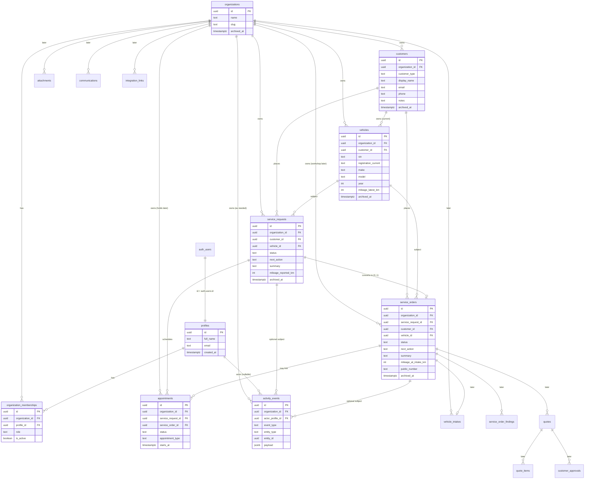

# Avtoservis Selan — Data Model & Auth Design V1

**Status:** DESIGN ONLY — awaiting review/approval before any migration
**Baseline code:** `7e073f032fc8a195166b82b37b09c6e1946c8a01` (docs may advance on `main` after Architecture Freeze commits)
**Supabase project:** `avtoservis-selan` (`verxxsjbewmkgoxwqvxo`)
**Roadmap contract:** [`docs/implementation-plan.md`](./implementation-plan.md) — migration **slices** must follow that plan; this doc defines the domain model, not a single mega-migration.
**Scope of this phase:** documentation under `docs/` only — no migrations, SQL, Auth changes, Edge Functions, commits, or deploys

### Dashboard V1 contract (binding)

The data model in this document is **subordinate** to the approved visible Dashboard V1 UI.

See: [`docs/dashboard-v1-preservation.md`](./dashboard-v1-preservation.md)

Backend/domain work must be wired **additively** behind the locked dashboard structure. Do not remove, simplify, replace, or materially rename approved UI to fit the schema. If architecture conflicts with the UI: **STOP** and report before changing the UI.

### Product scope terms (use consistently)

| Term | Meaning |
|---|---|
| **Phase 1 administrative V1** | Inquiry → data completion → quote/offer → customer approval → appointment holds/selection → confirm → Calendar/MyPlanly handoff. Operates primarily on **`service_requests`** (+ later appointments/holds/integrations). Does **not** require `service_orders`. |
| **Workshop operations / Phase 2 product scope** | Physical vehicle intake, diagnosis, repair, pickup — the **`service_orders`** lifecycle and related workshop entities. Deferred until Phase 1 administrative workflow is stable ([implementation plan](./implementation-plan.md) Phase 16 / M10). |

Do **not** use “MUST V1” for `service_orders` if that implies Phase 1 administrative delivery requires them.

---

## 1. Executive summary

Avtoservis Selan needs a **workshop-specific operational data model**, not a generic ERP. The current Dashboard V1 already encodes useful domain language (servisni nalogi, povpraševanja, termini, ponudbe, stranke, vozila, next-action, attention), but flattens multiple lifecycles into one `ServiceOrderDemo` status enum and denormalizes customer/vehicle onto a single row.

Confirmed Phase 1 operational journey (Tadej) is primarily **administrative**: intake → data completion → quote/offer → customer approval → appointment holds/selection → confirm → sync out. Workshop repair completion is a later lifecycle and must not be confused with Phase 1 “Zaključeno”.

**Recommended foundation:**

| Decision | Recommendation |
|---|---|
| UI contract | Data model subordinate to [Dashboard V1 preservation](./dashboard-v1-preservation.md) |
| Roadmap slices | Follow [implementation plan](./implementation-plan.md): foundation → customers/vehicles/requests → … → appointments/holds → … → workshop `service_orders` last |
| Tenant | Single workshop as `organizations` row; all business tables carry `organization_id` |
| Auth | Supabase Auth `auth.users` → `profiles` → `organization_memberships` (role + active flag). Roles are **not** authoritative in `user_metadata` |
| Customer / vehicle | Separate entities; one customer → many vehicles; history survives across orders; manual entry should search/reuse existing records |
| Request vs order | **Separate** architectural entities. Phase 1 admin runs on **`service_requests`**. `service_orders` remain in the **long-term** domain model and ER diagram, but are **not** in the first foundation or first business-data migrations |
| Appointment | Belongs primarily to **service_request**; temporary holds required for Phase 1 — delivered in a **dedicated later slice**, not the first migration |
| Statuses | **Separate** backend statuses per entity; dashboard Slovenian workflow concepts are a **derived/presentation** view — not one giant DB enum |
| Attention / Napaka | **Not** a lifecycle status — derived operational/error flags; keep Potrebna pozornost panel |
| Mileage | Historical reading per visit/request/intake; vehicle keeps only a latest cache |
| Integrations | Quibi, Google Calendar, MyPlanly are adapters; our app keeps canonical IDs via future `integration_links` |
| Human gates | Price/quote internal approval and final customer confirmation remain human; automation prepares, does not bypass |
| First migrations | **Small slices only:** (A) org/auth/RLS foundation → (B) customers + vehicles + service_requests — never one mega-migration of all entities |

This document is the design contract for the domain. **Do not implement migrations until Architecture Freeze approvals are explicit** (see implementation plan Phase 1).

---

## 2. Domain terminology

### 2.1 Terms used in the current repo (UI / demo)

| Term (SI) | Code / type | Meaning in UI today |
|---|---|---|
| Nadzorna plošča | `/dashboard` | Only live route |
| Servisni nalog | `ServiceOrderDemo` | Denormalized work row spanning inquiry → appointment → quote wait |
| Povpraševanja | nav `inquiries` | Planned list; not implemented |
| Termini | `AppointmentDemo` | Day list: sprejem / servis / diagnoza |
| Ponudbe | nav `offers` | Planned |
| Stranke / Vozila | nav | Planned |
| Next action | `nextActionLabel` | Human “what to do next” |
| Potrebna pozornost | `AttentionItemDemo` | Separate attention list (critical/warning/info) — **not** a workflow status |
| Ročni vnos | `ManualServiceOrderEntry` | Collects customer + vehicle + service intent; button says “Ustvari servisni nalog” |
| Administrator | `CURRENT_USER.role` | Hardcoded demo user (Tadej) |

### 2.2 Proposed domain terms (canonical)

| Term | English table/entity | Definition |
|---|---|---|
| Delavnica / organizacija | `organizations` | Tenant owning all workshop data (Avtoservis Selan) |
| Član | `organization_memberships` | Auth user belonging to a workshop with a role |
| Stranka | `customers` | Person or company bringing vehicles |
| Vozilo | `vehicles` | Physical vehicle, preferably identified by VIN when known |
| Povpraševanje / zahteva | `service_requests` | Incoming inquiry **before** (or until) workshop operational acceptance |
| Servisni nalog | `service_orders` | Accepted operational workshop job |
| Termin | `appointments` | Scheduled slot (intake / service / diagnosis) |
| Naslednji korak | `next_action` (field or derived) | What staff should do now |
| Pozornost | attention flag / later `attention_items` | Blocker or anomaly requiring human attention — **not** a status |
| Aktivnost | `activity_events` | Audit/activity feed |

### 2.3 Mismatches to resolve

1. **UI type name `ServiceOrderDemo` spans both inquiry and order** — nav already separates “Povpraševanja” and “Servisni nalogi”.
2. **Single `WorkflowStatusId` mixes** data-collection, quote, appointment, and completion phases.
3. **“Potrebna pozornost”** appears as a product concept in the brief/UI attention panel but is **not** in `WorkflowStatusId` — keep it out of lifecycle enums.
4. **Manual entry** labels the result “servisni nalog” while collecting pre-acceptance inquiry fields (and requires VIN/mileage early — may be too strict for phone-first intake).
5. **Demo denormalizes** customer name/phone and vehicle make/model onto the work row — DB must not.
6. **Demo data** reuses registration `LJ 41-NPK` under different customer names — reinforces need for vehicle identity (VIN) and customer↔vehicle ownership.
7. Soft conflicts with Dashboard V1 are documented in [`dashboard-v1-preservation.md`](./dashboard-v1-preservation.md) — resolve by mapping, not UI redesign.

---

## 2.4 Phase 1 business workflow (confirmed — Tadej)

### Intake sources (same canonical case)

All of the following create the **same** canonical `service_request` (case):

| Source | `source` / channel value (suggested) |
|---|---|
| Web form | `web_form` |
| Phone | `phone` |
| SMS | `sms` |
| Manual entry (dashboard) | `manual` (UI wording unchanged; backend may create `service_request`) |

Manual entry should **search/reuse** existing customer and vehicle where possible (phone, email, registration, VIN) instead of always inserting duplicates.

### Unified administrative flow

```text
new inquiry (service_request)
  → verify customer / vehicle / service data
  → if missing: automatic email requesting completion
  → completed data attaches back to the SAME case
  → when complete: create/open Quibi quote-estimate draft (integration)
  → internal review/approval of price  (human gate)
  → send offer to customer
  → wait for customer approval         (human gate)
  → after approval: offer available appointment slots
  → temporarily HOLD offered slots (cannot be offered to another customer)
  → customer selects one
  → release unused holds
  → confirm selected appointment
  → write confirmed appointment to Google Calendar (integration)
  → transfer/sync appointment/data to MyPlanly (integration)
  → MyPlanly continues existing SMS/email reminders
```

### Architecture consequences

1. One canonical `service_request` per inquiry regardless of web / phone / SMS / manual.
2. `source` distinguishes origin; do not create parallel entity types per channel.
3. `service_request` and `service_order` remain **separate**; Phase 1 primarily covers the journey **up to confirmed appointment** (still shown in the existing unified dashboard list).
4. Creating a workshop `service_order` (bay/repair) is a later step — conversion timing remains an open product question, but Phase 1 “done” ≠ vehicle repair complete.
5. **Temporary appointment holds** are a real business requirement and must be represented (see §5.8 / §7).
6. Quibi, Google Calendar, and MyPlanly are **integrations, not systems of record**.
7. Our app keeps canonical internal IDs; external IDs live in `integration_links` (later).
8. Price/quote and final confirmation retain **human approval**; automation prepares drafts and messages but does not remove those gates.
9. Dashboard V1 visible structure stays intact; backend state is mapped into existing panels/strip/list.

### Dashboard-visible states requested by Tadej

Preserve these as **visible** concepts (labels/structure per preservation rule). Do **not** automatically collapse them into one database enum.

| Visible state | Recommended backend treatment |
|---|---|
| Novo | Lifecycle on `service_requests` (`new`) |
| Manjkajo podatki | Lifecycle on `service_requests` (`needs_data`) + missing-field metadata |
| Priprava ponudbe | Lifecycle on request (Phase 1) and/or later `quotes.status` (`draft` / preparing); human internal price review in progress |
| Čaka potrditev ponudbe | Lifecycle awaiting customer approval of offer (`awaiting_customer_approval` / later quote `sent`) |
| Čaka izbiro termina | Lifecycle on request + appointments in offered/held state |
| Termin potrjen | Confirmed appointment + request status `appointment_confirmed` |
| Zaključeno | **Phase 1 meaning:** administrative journey complete (appointment confirmed and handoff/sync done or case closed without workshop repair tracking yet). **Not** “vehicle repair finished”. Repair completion is a later `service_orders` terminal state. |
| Napaka | **Derived attention/error flag** (and Potrebna pozornost), **not** a primary lifecycle status — e.g. failed email, Quibi sync failure, calendar write failure, stuck automation |

Existing Dashboard V1 also shows **Potreben pregled** in the workflow strip; treat that as a later/workshop-oriented visible state mapped mainly from `service_orders`, without removing it from the UI.

---

## 3. Core entity model

Long-term domain shape (not a single migration):

```
organizations
    ├── organization_memberships ── profiles ── auth.users     ← Slice A
    ├── customers                                               ← Slice B
    │       └── vehicles                                        ← Slice B
    ├── service_requests ──→ (optional, later) service_orders   ← Slice B → workshop later
    │       └── appointments (holds)                            ← dedicated later slice
    ├── service_orders ──→ appointments (optional back-link)    ← workshop Phase 2 scope
    └── activity_events                                         ← as needed (not first slice)
```

**Ownership rule:** every business row has `organization_id`. Access requires an **active** membership in that organization.

**Identity rule:** our UUIDs are canonical. External systems never own primary keys.

**Canonical intake `source` values** (use everywhere; do not invent aliases like `web`):

`web_form` | `phone` | `sms` | `manual` | `other`

---

## 4. Mermaid ER diagram

Reflects the **full proposed relational domain model** (Phase 1 admin + future workshop).
**Presence on this diagram does not mean the entity is created in the first migration.** See §14–§15 and the [implementation plan](./implementation-plan.md) for slice order.



---

## 5. Table-by-table design

Conventions for all tables unless noted:

- **PK:** `id uuid` default `gen_random_uuid()`
- **Tenant:** `organization_id uuid not null` → `organizations(id)`
- **Timestamps:** `created_at timestamptz not null default now()`, `updated_at timestamptz not null default now()`
- **Provenance (where meaningful):** `created_by uuid null` → `profiles(id)`, `updated_by uuid null` → `profiles(id)`
- **Soft archive:** `archived_at timestamptz null` (null = active). Prefer archive over hard delete for operational entities.
- **Do not duplicate:** customer name/phone/email or vehicle make/model/VIN onto request/order except for **immutable snapshots** only when legally/operationally required (V1: avoid snapshots; join live entities; add snapshots later if Quibi export/print needs freeze-in-time).

### 5.1 `organizations` (Slice A — foundation)

| Aspect | Design |
|---|---|
| Purpose | Workshop/company tenant |
| Important columns | `name` (req), `slug` (req, unique), `timezone` (req, default `Europe/Ljubljana`), `phone` (opt), `email` (opt), `address` (opt, later OK), `archived_at` |
| Relationships | Parent of all business data |
| Indexes | unique(`slug`) |
| Archive | Soft-archive org only for extreme cases; normally never deleted |
| Notes | V1 expects **one** org (Avtoservis Selan). Multi-tenant shape is intentional for clean RLS. |

### 5.2 `profiles` (Slice A — foundation)

| Aspect | Design |
|---|---|
| Purpose | App-facing user profile 1:1 with `auth.users` |
| PK | `id uuid PK` = `auth.users.id` |
| Important columns | `full_name` (req), `email` (req, copy for display), `phone` (opt), `avatar_url` (opt), timestamps |
| Relationships | Referenced by memberships, activity, created_by |
| Archive | Prefer deactivate via membership `is_active`; do not delete profile casually |
| Notes | Created by trigger on `auth.users` insert (implementation detail for migration phase). **No roles on this table.** |

### 5.3 `organization_memberships` (Slice A — foundation)

| Aspect | Design |
|---|---|
| Purpose | Links profile → organization with role and active flag |
| Important columns | `organization_id` (req), `profile_id` (req), `role` (req: `owner` \| `admin` \| `advisor` \| `mechanic`), `is_active` (req, default true), `invited_at`, `joined_at`, `disabled_at` |
| Constraints | unique(`organization_id`, `profile_id`) |
| Indexes | (`organization_id`, `is_active`), (`profile_id`) |
| Archive | Set `is_active = false` + `disabled_at`; keep row for audit |
| Auth rule | **This is the source of truth for authorization** |

### 5.4 `customers` (Slice B — first business data)

| Aspect | Design |
|---|---|
| Purpose | Person or business customer |
| Important columns | `customer_type` (`individual` \| `business`, default `individual`), `display_name` (req — person full name or company name), `email` (opt), `phone` (opt), `notes` (opt, internal), `source` (opt: `web_form` \| `phone` \| `sms` \| `manual` \| `other`), address fields **optional / later**, `archived_at` |
| Required for create | `organization_id`, `display_name` — email/phone strongly encouraged but not both mandatory at DB level (phone-first calls happen) |
| Relationships | Has many `vehicles`, many requests; later many `service_orders` |
| Indexes | (`organization_id`, `archived_at`), trigram/normalized search later; unique constraints **not** on phone/email in early slices |
| Duplicate strategy | Normalize phone/email in app; warn via attention UI; optional later `duplicate_of_customer_id` |
| Do not duplicate | Do not store customer fields on requests/orders as master copy |

### 5.5 `vehicles` (Slice B — first business data)

| Aspect | Design |
|---|---|
| Purpose | Persistent vehicle record under a customer |
| Permanent fields | `vin` (opt but unique per org when present), `make` (req once known), `model` (req once known), `year` (opt), `power_kw` (opt), `engine_displacement_cc` or text `engine_displacement` (opt), `engine_code` (opt), `fuel` (opt enum), `registration_current` (opt — **current** plate), `notes` (opt), `mileage_latest_km` (opt **cache only**), `mileage_latest_recorded_at` (opt) |
| Per-visit fields (NOT only on vehicle) | Mileage at request/intake/order; registration at time of visit if needed later |
| Relationships | `customer_id` current owner (req in Slice B+); history of ownership changes = later if needed |
| Indexes | unique partial (`organization_id`, `vin`) where vin not null; (`organization_id`, `registration_current`); (`customer_id`) |
| VIN care | Treat as sensitive identifier; never public; allow null while `manjkajo_podatki` |
| Registration | Can change; store current on vehicle; do not assume lifetime identity |
| Archive | Soft-archive; keep linked order history |

### 5.6 `service_requests` (Slice B — Phase 1 administrative primary entity)

| Aspect | Design |
|---|---|
| Purpose | Canonical inquiry / case for **Phase 1 administrative V1** (and remains the pre-workshop case thereafter) |
| Important columns | `customer_id` (opt early, req before offer/convert), `vehicle_id` (opt early), `status` (req), `priority` (opt), `summary` (req — short “what they want”), `problem_description` (opt/text), `service_wanted` (opt), `brings_own_material` (bool opt), `mileage_reported_km` (opt — customer-reported), `source` (recommended req: `web_form` \| `phone` \| `sms` \| `manual` \| `other`), `channel` (opt detail), `missing_fields` (text[] or jsonb opt), `next_action` (text opt), `attention_needed` (bool default false), `attention_reason` (opt), `has_error` (bool opt — Napaka), `error_reason` (opt), timestamps, `archived_at` |
| Deferred FK | `converted_service_order_id` — add only when `service_orders` workshop slice exists |
| Status (request) | See §7 |
| Relationships | Later 0..1 `service_orders`; later 0..n `appointments` |
| Indexes | (`organization_id`, `status`, `updated_at desc`), (`customer_id`), (`vehicle_id`), (`attention_needed`) where true |
| Archive | Soft-archive declined/spam; keep for audit |

### 5.7 `service_orders` (WORKSHOP / Phase 2 product scope — NOT first migrations)

| Aspect | Design |
|---|---|
| Purpose | Operational workshop job after physical acceptance / bay work — **long-term domain entity**, not required for Phase 1 administrative V1 |
| When to migrate | Only in workshop-operations phase ([implementation plan](./implementation-plan.md) Phase 16) unless a later **explicitly approved** slice proves earlier need |
| Important columns | `service_request_id` (opt — walk-in may skip request, or create request+order together), `customer_id` (req), `vehicle_id` (req), `public_number` (req, org-scoped human number like `1050`), `status` (req), `summary` (req), `location_label` (opt — “Dvigalo 2”), `mileage_at_intake_km` (opt), `next_action` (opt), `attention_needed` (bool), `opened_at`, `ready_at`, `completed_at`, `archived_at` |
| Relationships | Optionally from one request; many appointments; later findings/quotes/intake |
| Indexes | unique(`organization_id`, `public_number`); (`organization_id`, `status`, `updated_at desc`); (`vehicle_id`); (`customer_id`) |
| Do not duplicate | Customer/vehicle master fields |
| Archive | Soft-archive; almost never hard-delete completed work |
| Phase 1 note | Dashboard may still show a unified list driven by `service_requests`; UI labels stay locked |

### 5.8 `appointments` (Phase 1 admin capability — dedicated later slice)

| Aspect | Design |
|---|---|
| Purpose | Scheduled time slots **and temporary holds** on offered slots |
| Migration timing | **Not** in Slice A or B. Dedicated roadmap phase for availability + holds ([implementation plan](./implementation-plan.md) Phase 10) after earlier admin slices |
| Important columns | `service_request_id` (req for Phase 1 booking; preferred always), `service_order_id` (opt — only after workshop orders exist), `customer_id` (req), `vehicle_id` (opt), `appointment_type` (`intake`/`sprejem` \| `service`/`servis` \| `diagnosis`/`diagnoza`), `status` (req), `starts_at` (req), `ends_at` (opt), `hold_expires_at` (opt — required when status is held), `held_for_service_request_id` (opt; usually same as `service_request_id`), `proposed_slots` (jsonb opt — alternative representation of multiple offered candidates), `notes` (opt internal), `cancelled_at` |
| Ownership | **Primary:** request during booking phase. **Also** link to order when order exists. Phase 1: require `service_request_id`. |
| Holds (Phase 1 requirement) | After customer approves the offer, the system offers available slots and **temporarily holds** them so they cannot be offered to another customer. On selection: confirm chosen slot; **release unused holds**. Holds may expire (`hold_expires_at`) and must free capacity. Prefer explicit rows over only jsonb so exclusivity can be enforced. |
| Indexes | (`organization_id`, `starts_at`); (`service_request_id`); (`service_order_id`); (`status`); partial unique/exclusion later for non-overlapping held/confirmed slots per bay/resource if/when resources exist |
| Archive | Cancel / release via status; retain history |

### 5.9 `activity_events` (as needed — not first foundation slice)

| Aspect | Design |
|---|---|
| Purpose | Dashboard “Aktivnost” + basic audit trail |
| Migration timing | Introduce lightly when Manual Entry / dashboard wiring needs it; expand through later phases — **not** required in Slice A |
| Important columns | `actor_profile_id` (null = system), `event_type` (text), `entity_type` (text), `entity_id` (uuid), `payload` (jsonb), `occurred_at` (default now()) — no `archived_at`; append-only |
| Indexes | (`organization_id`, `occurred_at desc`); (`entity_type`, `entity_id`) |
| Delete | No casual delete; retention policy later |

### 5.10 Later entities (design sketch — not Slice A/B)

Includes workshop `service_orders` dependents and other deferred tables. Full `service_orders` table itself is also deferred (see §5.7).

#### `vehicle_intakes` (LATER — workshop)

Purpose: structured intake moment (photos checklist, odometer confirmation, damage notes).
FK: `service_order_id` (req), `vehicle_id`, `mileage_km`, `intake_at`, `received_by`.
Mileage here is the authoritative visit reading; updates `vehicles.mileage_latest_*` cache.

#### `service_order_findings` (LATER)

Purpose: diagnosis / additional faults discovered.
Visibility: `visibility` = `internal` \| `customer_safe`.
Do not conflate with customer email body.

#### `quotes`, `quote_items`, `customer_approvals` (LATER)

Purpose: replace “Priprava ponudbe / Čaka potrditev”.
Quote status separate from order status. Approval records who/when/channel.

#### `attachments` (LATER)

Purpose: metadata for Storage objects (intake/diagnosis/repair photos, PDFs).
Columns: `bucket`, `path`, `mime`, `size`, `entity_type`, `entity_id`, `visibility` default `internal`, `uploaded_by`.

#### `communications` (LATER)

Purpose: outbound/inbound email/SMS/WhatsApp log (customer-visible channel history).
Separate from internal notes (`customers.notes`, findings internal, order internal notes).

#### `integration_links` (LATER)

Purpose: map our entity → external system without polluting business tables.
See §12.

#### `attention_items` (OPTIONAL LATER)

Purpose: durable attention queue (failed email, duplicate suspicion).
V1 can start with `attention_needed` boolean + reason on request/order; promote to table when needed.

---

## 6. Relationship rules

1. **Org isolation:** every query is scoped by `organization_id`.
2. **Customer → vehicles:** 1:N. A vehicle has one **current** `customer_id` in V1.
3. **Vehicle history:** service_requests and service_orders reference `vehicle_id`; deleting/archiving a customer must not destroy order history (restrict or reassign; prefer archive customer + keep FKs).
4. **Request → order:** at most **one** active conversion (`service_orders.service_request_id` unique when not null, or `service_requests.converted_service_order_id` unique).
5. **Not every request becomes an order:** declined / cancelled / spam / customer no-show without acceptance stay as requests.
6. **Walk-in / phone-to-bay:** Phase 1 admin creates/updates a `service_request`. Creating a workshop `service_order` is deferred to workshop scope (see open questions).
7. **Appointment:** may exist before any order; Phase 1 booking must not require `service_order_id`.
8. **No duplicated masters:** UI joins customer/vehicle; list demos today are denormalized projections only.
9. **External IDs:** never as PK; never as required columns on core tables.
10. **Migration slices:** do not create `appointments`, `service_orders`, quotes, or integration tables in Slice A/B.

---

## 7. Workflow / status design

### 7.1 Do not keep one huge status enum

Dashboard V1 visible workflow concepts (including Tadej’s Phase 1 list) are a **UX aggregation**. Backend uses separate lifecycles. See also §2.4 and [Dashboard V1 preservation](./dashboard-v1-preservation.md).

| Visible SI concept | Better home |
|---|---|
| Novo | `service_requests.status = new` |
| Manjkajo podatki | `service_requests.status = needs_data` (+ `missing_fields`) |
| Priprava ponudbe | Phase 1: `service_requests.status` (e.g. `preparing_offer`) and/or later `quotes.status`; internal price approval gate |
| Čaka potrditev ponudbe | Phase 1: request/quote awaiting customer approval |
| Čaka izbiro termina | request status + appointments `offered`/`held` |
| Termin potrjen | `appointments.status = confirmed` + request `appointment_confirmed` |
| Zaključeno | **Phase 1:** administrative case complete (see §2.4) — **not** repair finished |
| Napaka | **Derived** error/attention — not a primary lifecycle enum value |
| Potrebna pozornost | Attention panel / flags — not a lifecycle status |
| Potreben pregled (existing UI) | Later mainly `service_orders` (diagnosis) — keep visible; map when orders exist |

### 7.2 Recommended status sets

**`service_requests.status` (Phase 1–oriented)**

| Status | Visible mapping |
|---|---|
| `new` | Novo |
| `needs_data` | Manjkajo podatki (auto email may request completion; replies attach to **same** request) |
| `preparing_offer` | Priprava ponudbe (incl. Quibi draft + internal price approval) |
| `awaiting_customer_approval` | Čaka potrditev ponudbe |
| `awaiting_slot_selection` | Čaka izbiro termina (slots offered + held) |
| `appointment_confirmed` | Termin potrjen |
| `admin_completed` | Zaključeno **(Phase 1)** — admin journey done / synced; not repair complete |
| `converted` | Became a workshop `service_order` (may be later than Phase 1) |
| `declined` / `cancelled` / `closed` | Terminal without successful booking / withdrawn |

**`appointments.status`**

| Status | Meaning |
|---|---|
| `proposed` | Internal draft |
| `offered` | Presented to customer |
| `held` | **Temporary hold** — exclusive for this case until select/expire/release |
| `selected` | Customer picked this slot |
| `confirmed` | Confirmed; then sync Calendar / MyPlanly |
| `released` | Hold released (unused after selection or expiry) |
| `checked_in` | Arrived / intake started (later) |
| `completed` | Slot fulfilled (later) |
| `cancelled` | Cancelled |
| `no_show` | Did not arrive |

**`service_orders.status` (workshop — largely post–Phase 1)**

| Status | Meaning |
|---|---|
| `intake` | Sprejem / opened on bay |
| `diagnosis` | Potreben pregled / diagnostics |
| `waiting_approval` | Additional work approval (distinct from Phase 1 offer approval when quotes mature) |
| `in_repair` | Repair in progress |
| `ready` | Ready for pickup |
| `completed` | Repair/job **Zaključeno** (workshop sense — do not conflate with request `admin_completed`) |
| `cancelled` | Cancelled after acceptance |

Until `quotes` tables exist, Phase 1 offer states live on `service_requests` (and activity/integration payloads). Add quote tables when ready; **do not** force one shared enum across request/order/quote/appointment.

### 7.3 `next_action`, attention, and Napaka

| Concept | Storage | Notes |
|---|---|---|
| `next_action` | `text` on request and order (nullable) | Human label for dashboard. Default from status; override when staff sets a specific action |
| `attention_needed` | `boolean` | Derived **or** explicitly set |
| `error_state` / Napaka | flag + reason (and/or attention severity `critical`) | Failed auto-email, Quibi/Calendar/MyPlanly sync errors, etc. |
| Attention severity | later table / enum | Matches demo `critical` \| `warning` \| `info` |
| “Potrebna pozornost” / Napaka | **Flag / queue**, never the sole lifecycle status | Preserve existing attention panel; Napaka may surface there and/or as a strip count derived from flags |

**Derivation examples (application logic, not DB enum):**

- Email delivery failure → Napaka / attention critical on the same `service_request`
- Missing VIN while status requires it → `needs_data` (+ optional attention)
- Hold expiry without selection → attention warning + return capacity
- Duplicate customer suspicion → attention warning
- Integration sync failure after confirm → Napaka without rolling back confirmed appointment unless staff decides

Dashboard question: **“Kaj mora Tadej / mehanik narediti naslednje?”** → `next_action` + attention/Napaka queue + today’s appointments — not one mega-status.

### 7.4 Mapping to the locked Dashboard V1 strip

Keep the strip, table, and panels as approved. Implement a **presentation query** that derives visible badges/counts from request (+ later order/quote) state and attention flags.

UI labels stay Slovenian; DB stores stable English snake codes.

---

## 8. Auth model

```
auth.users  1:1  profiles
                 └── organization_memberships (organization_id, role, is_active)
```

### 8.1 Principles

1. Sign-in via Supabase Auth (email/password or magic link — product choice later).
2. `profiles.id = auth.users.id`.
3. **Authorization data lives in `organization_memberships`**, enforced by RLS.
4. `auth.users.raw_user_meta_data` / `app_metadata` may hold display hints only — **never** sole source for role checks.
5. Anonymous auth stays disabled for production workshop data.
6. Public customer forms (future) use separate constrained paths (Edge Function / limited insert) — not staff RLS roles.

### 8.2 Inviting a new employee (future flow)

1. Owner/admin invites by email (Supabase invite or app-created auth user).
2. Profile row created (trigger).
3. Admin inserts `organization_memberships` with role + `is_active = true`.
4. User sets password / accepts invite.
5. To remove access: `is_active = false` (do not rely on deleting auth user immediately).

V1 migration can seed **one** org + memberships for Aleš/Tadej manually after approval — not part of this design-only phase.

---

## 9. Roles and permissions

### 9.1 Roles — mechanic access NOT YET CONFIRMED

| Role | Need in V1? | Rationale |
|---|---|---|
| `owner` / `admin` | **Yes** | Full access |
| `advisor` (reception / service advisor) | **Yes** | Administrative workflow (Phase 1 journey) |
| `mechanic` | Schema placeholder | **Awaiting Tadej confirmation** — see open question below |

**Current recommendation (NOT YET CONFIRMED by Tadej):**

- `admin` / `owner` = full access
- reception / service advisor = administrative workflow access
- mechanic = limited operational access (assigned/needed data only) **or** full access — **undecided**

Do **not** treat the matrix below as final policy. Avoid shipping irreversible RLS that assumes mechanic scope until Tadej confirms:

1. full access, or
2. restricted access to assigned/needed operational data only.

### 9.2 Capability matrix (conceptual draft only)

| Capability | owner/admin | advisor | mechanic (UNCONFIRMED) |
|---|---|---|---|
| Manage memberships | yes | no | no |
| Customers / vehicles CRUD | yes | yes | TBD (read vs limited) |
| Service requests | yes | yes | TBD |
| Appointments | yes | yes | TBD |
| Service orders | yes | yes | TBD (likely progress updates if restricted) |
| Archive core records | yes | yes (limited) | no |
| Activity read | yes | yes | TBD |

Prefer coarse active-member RLS first; tighten mechanic rules only after confirmation.

---

## 10. RLS strategy

**Core rule:** authenticated user may access a row iff:

```text
exists (
  select 1 from organization_memberships m
  where m.organization_id = <row>.organization_id
    and m.profile_id = auth.uid()
    and m.is_active = true
)
```

Helper: SQL function `app_is_active_member(org_id uuid)` security definer / stable — details at migration time.

### 10.1 Policy concepts by table

| Table | SELECT | INSERT | UPDATE | DELETE / archive |
|---|---|---|---|---|
| `organizations` | active members of that org | service-role / bootstrap only | owner/admin | owner only (rare); prefer archive |
| `profiles` | self + members sharing an org | trigger / service-role | self (name/phone); admin limited | no hard delete |
| `organization_memberships` | members of same org | owner/admin | owner/admin (role/active) | owner/admin soft-disable |
| `customers` | active members | advisor+ | advisor+ | archive by advisor+; no hard delete in client |
| `vehicles` | active members | advisor+ | advisor+ | archive by advisor+ |
| `service_requests` | active members | advisor+ | advisor+ | archive by advisor+ |
| `service_orders` | active members | advisor+ | advisor+ ; mechanic **TBD** | archive by advisor+ |
| `appointments` | active members | advisor+ | advisor+ | cancel/archive by advisor+ |
| `activity_events` | active members | members (or trigger-only) | **none** (immutable) | **none** via client |

### 10.2 Service-role boundaries (never in browser)

Must use service-role / server-only for:

- Bootstrap org + first admin
- Auth invite orchestration if needing elevated inserts
- GDPR hard-anonymization jobs
- Cross-tenant maintenance
- Trusted inbound webhooks from integrations (later)
- Storage cleanup sweeps

**Never** expose service-role key in Next.js client bundles or `NEXT_PUBLIC_*`.

---

## 11. Storage / photo strategy

**Do not create buckets in this phase.**

### 11.1 Recommendations

| Topic | Recommendation |
|---|---|
| Bucket | One private bucket `workshop-media` (or `org-media`) — **not public** |
| Path | `{organization_id}/{entity_type}/{entity_id}/{yyyy}/{uuid}-{filename}` |
| Categories | intake, diagnosis, repair, other — store as attachment `category` metadata, not separate public buckets |
| Access | Private objects; short-lived signed URLs for staff UI |
| Ownership check | Storage policies: user must be active member of `organization_id` path prefix; optionally verify `attachments` row |
| Customer portal | Later: explicit share tokens or server-mediated signed URLs — never public listing |

Vehicle/customer photos are personal/operational data — **default private**.

---

## 12. Integration strategy

### 12.1 Boundary

Our app is the **operational system of record**. Quibi, MyPlanly, Google Calendar, email/SMS are replaceable adapters — not authoritative for case state, holds, or approvals.

Phase 1 integration touchpoints (outbound/inbound as designed later):

| Step | System | Our app remains source of truth for |
|---|---|---|
| Quote-estimate draft | Quibi | Case identity, internal price approval gate, offer status |
| Confirmed appointment write | Google Calendar | Appointment row + hold/confirm lifecycle |
| Appointment/data sync + reminders | MyPlanly | Canonical appointment; MyPlanly continues SMS/email reminders |
| Missing-data email | Email | Same `service_request`; completion attaches to same case |

### 12.2 Prefer `integration_links` (later) over scattered columns

```text
integration_links
  organization_id
  provider        -- 'quibi' | 'myplanly' | 'google_calendar' | 'email' | ...
  entity_type     -- 'customer' | 'vehicle' | 'service_request' | 'service_order' | 'appointment' | ...
  entity_id       -- our UUID
  external_id     -- their id
  external_payload jsonb  -- optional non-authoritative cache
  last_synced_at
  unique(organization_id, provider, entity_type, entity_id)
  unique(organization_id, provider, entity_type, external_id)
```

**Avoid** `quibi_id`, `myplanly_id`, `google_id` on every business table.

### 12.3 Appointment offers and holds

Store offered/held/confirmed slots in **our** `appointments` (preferred) so exclusivity and release are enforceable. MyPlanly/Calendar sync **after** confirm (and optionally mirror earlier if needed) — UI and capacity logic must not require those systems to be online to understand holds.

---

## 13. GDPR / audit considerations

| Topic | Approach |
|---|---|
| Timestamps | `created_at` / `updated_at` everywhere |
| Provenance | `created_by` / `updated_by` on mutable business tables where meaningful |
| Activity | Append-only `activity_events` for status changes, creates, sends |
| Internal vs customer | Internal notes ≠ communications; findings `visibility` later |
| Soft archive | Default for customers, vehicles, requests, orders |
| Erasure | Prefer **anonymize** customer PII (`display_name` → “Anonim inovano”, clear email/phone) while retaining service_order rows needed for business records |
| Attachments | On erasure request: delete/anonymize storage objects linked to personal intake photos per policy; keep non-personal technical records if legally needed |
| Hard delete | Not from client apps; admin/service job only |
| Retention | Define with Aleš later; design supports retention without forcing early deletion |

This is not legal advice — implementation policies need owner confirmation.

---

## 14. Scope vs migration slices

Aligned with [`docs/implementation-plan.md`](./implementation-plan.md). **Do not combine all business entities into one initial migration.**

### Phase 1 administrative V1 — domain needed (tables arrive in slices)

| Capability | Entity | Migration timing |
|---|---|---|
| Tenant + Auth + RLS | `organizations`, `profiles`, `organization_memberships` | **Slice A** (roadmap Phase 2) |
| Customers / vehicles / cases | `customers`, `vehicles`, `service_requests` | **Slice B** (roadmap Phase 3) |
| Activity feed | `activity_events` | As needed (from Manual Entry onward; not Slice A) |
| Appointments + temporary holds | `appointments` | Dedicated later slice (roadmap Phase 10) |
| Quotes / Quibi mapping | quotes + `integration_links` | Dedicated later slices (roadmap Phases 8–9) |
| Calendar / MyPlanly | `integration_links` | Dedicated later slices (roadmap Phases 11–12) |

Phase 1 administrative workflow **operates primarily on `service_requests`**. Dashboard unified list maps from requests until workshop orders exist.

### Workshop operations / Phase 2 product scope — deferred

| Entity | Notes |
|---|---|
| `service_orders` | Long-term domain; ER keeps it; **not** in Slice A/B or first foundation |
| `vehicle_intakes`, findings, repair photos, etc. | After Phase 1 admin is stable (roadmap Phase 16) |

### Explicitly out of product scope for now

- Accounting, invoicing, inventory, procurement
- Complex employee scheduling / shifts
- AI extraction tables as systems of record
- CRM marketing automation
- Making Quibi/MyPlanly/Calendar schema-authoritative

---

## 15. Proposed migration order (roadmap-aligned slices)

*(Do not run until Architecture Freeze approvals are explicit. Match [implementation plan](./implementation-plan.md) phase ordering.)*

### Slice A — Secure foundation (roadmap Phase 2)

1. Extensions / helpers (`pgcrypto` / `uuid`, `updated_at` trigger function)
2. `organizations`
3. `profiles` + `auth.users` → profile trigger
4. `organization_memberships` (roles + active/inactive)
5. RLS helper functions
6. RLS on org / profile / membership
7. Controlled seed of single org + initial memberships (after approval; non-prod-first preferred)

**Gate:** RLS negative tests; no business tables yet.

### Slice B — First business data (roadmap Phase 3)

1. `customers` + RLS
2. `vehicles` + RLS
3. `service_requests` + RLS
4. Positive + cross-org denial tests

**Gate:** Manual Entry vertical slice can begin (roadmap Phase 4) against these tables only.

### Later dedicated slices (not one mega-migration)

| Later slice | Entities / work | Roadmap phase |
|---|---|---|
| Activity as needed | `activity_events` | Phases 4–5 / 13 |
| Appointments + temporary holds | `appointments` (+ hold/concurrency) | Phase 10 |
| Quotes / approvals | quote tables when ready | Phases 8–9 |
| Integrations | `integration_links`, Quibi / Calendar / MyPlanly | Phases 8, 11–12 |
| Workshop operations | `service_orders`, intakes, findings, photos… | Phase 16 |

Storage buckets and quote tables only when their phases start — **never** bundled into Slice A.

---

## 16. Risks / architecture decisions

| # | Decision | Risk if wrong | Mitigation |
|---|---|---|---|
| AD-1 | Separate `service_requests` and `service_orders` | Extra joins; staff confusion if UI unclear | Nav already separates; dashboard can show unified work queue |
| AD-2 | Appointments owned primarily by request | Orphans if request archived poorly | Restrict archive while future appointments exist; link to order when converted |
| AD-3 | Split statuses vs one enum | Dashboard strip harder | Explicit presentation mapping; UI preserved |
| AD-4 | Attention / Napaka as flags | Staff might want strip-only filters | Keep Potrebna pozornost; derive Napaka counts |
| AD-5 | VIN optional | Duplicate vehicles | Partial unique index + registration search + attention |
| AD-6 | Mileage cache on vehicle | Stale odometer | Always record per request/intake/order |
| AD-7 | Mechanic permissions | Over/under permission | **NOT CONFIRMED** — coarse RLS until Tadej decides |
| AD-8 | No integration columns on core tables | Slightly more join work later | `integration_links` keeps core clean |
| AD-9 | Demo “Ustvari servisni nalog” vs request entity | Language drift | **Do not change UI copy** without approval; backend may create `service_request` |
| AD-10 | Temporary appointment holds | Double-booking if only jsonb | Prefer explicit `held` appointment rows + expiry/release |
| AD-11 | Phase 1 “Zaključeno” vs repair complete | Wrong KPIs / closed jobs | Separate `admin_completed` (request) from order `completed` |
| AD-12 | Data model vs Dashboard V1 | Pressure to redesign UI | [Preservation rule](./dashboard-v1-preservation.md) wins |
| AD-13 | Small migration slices vs mega-schema | Temptation to ship `service_orders` early | Align with [implementation plan](./implementation-plan.md); Phase 1 admin = requests first |

---

## 17. Open questions requiring Aleš / Tadej confirmation

1. **Mechanic permissions (NOT YET CONFIRMED):** full access **or** restricted access to assigned/needed operational data only? (Current draft recommendation: admin full; advisor administrative; mechanic limited — **unconfirmed**.)
2. **Conversion trigger:** When does a povpraševanje become a workshop `service_order` — at appointment confirm, at physical intake, or manually by Tadej? (Phase 1 can complete administratively before an order exists.)
3. **Walk-ins:** Always create both request+order, or request-first until intake?
4. **VIN required when?** Phone/SMS often lack VIN — allow request without VIN (recommended), require before offer or at intake?
5. **Mileage:** Confirm historical per-visit recording + latest cache (recommended).
6. **Hold rules:** How long do offered slots stay held? Soft vs hard capacity? Any resource/bay dimension in V1?
7. **Public numbers:** Continue integer-like `#1048` per org on the unified list? Apply to `service_request` in Phase 1?
8. **Customer type:** Business vs individual on day one, or only `display_name`?
9. **Duplicate customers:** Soft-warn only (recommended) vs strict unique phone?
10. **Napaka in the workflow strip:** Count-only derived from flags, or also a filterable strip segment? (UI must keep Potrebna pozornost regardless.)
11. **Data retention / anonymization:** Expectations for cases, offers, and photos?
12. **Multi-user timeline:** Single-user until auth ships, or invite second user immediately after first migration?

---

## Appendix A — Repo inspection notes (Phase 2 Step 1)

**Inspected:**

- `src/lib/dashboard/types.ts`
- `src/lib/dashboard/statuses.ts`
- `src/lib/dashboard/demo-data.ts`
- `src/lib/dashboard/navigation.ts`
- `src/components/dashboard/*` (incl. `ManualServiceOrderEntry.tsx`)
- `src/components/layout/AppSidebar.tsx`
- `README.md`
- `supabase/config.toml`
- `supabase/.temp/project-ref` → `verxxsjbewmkgoxwqvxo`
- Routes: `/` → `/dashboard` only live app route
- No `supabase/migrations` directory present at design time

**Manual entry fields today:** fullName, email, phone, registration, vin*, make*, model*, year, mileage*, powerKw, engineDisplacement, engineCode, fuel, serviceWanted*, bringsOwnMaterial, problemDescription*.

**Appointment types today:** `sprejem` | `servis` | `diagnoza`.

---

## Appendix B — Safety statement

This document does **not** authorize:

- migrations
- SQL execution against linked project
- Auth setting changes
- user creation
- Storage bucket creation
- Edge Function deploy
- Vercel deploy
- git commit/push

Proceed to implementation only after explicit approval of this design.
